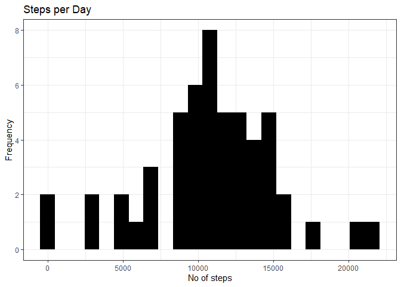
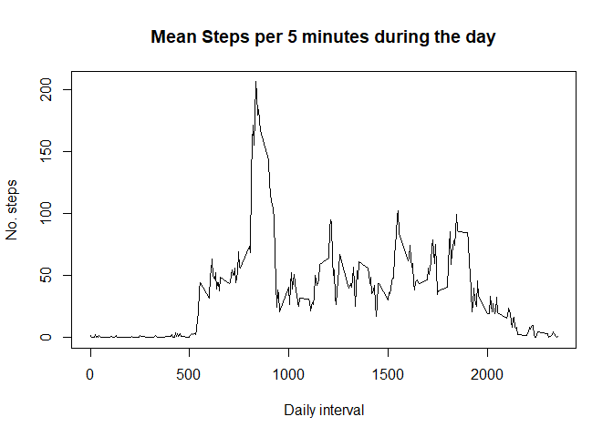
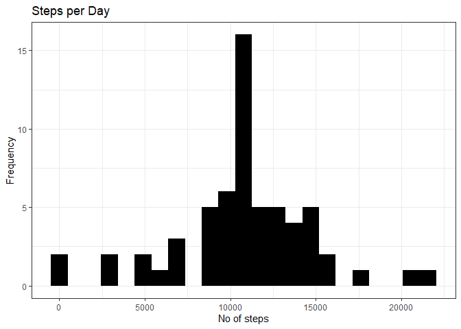
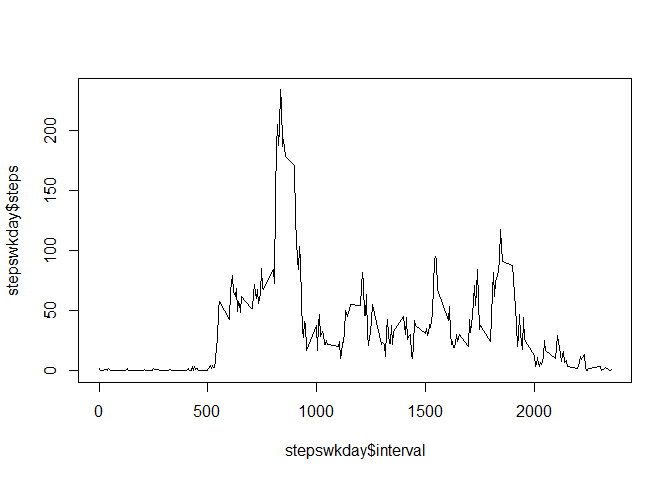
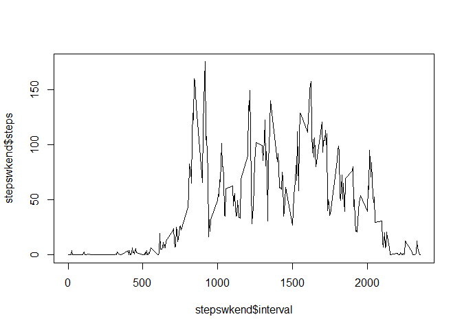

## Loading and preprocessing the data
This is an R Markdown file for the 1st project of the Reproducible research course in Coursera. 


```r
unzip("G:/Mi unidad/repdata_data_activity.zip")
activity<-read.csv("activity.csv")
```

To view our data


```r
str(activity)
```

```
## 'data.frame':	17568 obs. of  3 variables:
##  $ steps   : int  NA NA NA NA NA NA NA NA NA NA ...
##  $ date    : chr  "2012-10-01" "2012-10-01" "2012-10-01" "2012-10-01" ...
##  $ interval: int  0 5 10 15 20 25 30 35 40 45 ...
```

```r
head(activity)
```

```
##   steps       date interval
## 1    NA 2012-10-01        0
## 2    NA 2012-10-01        5
## 3    NA 2012-10-01       10
## 4    NA 2012-10-01       15
## 5    NA 2012-10-01       20
## 6    NA 2012-10-01       25
```

The variables steps and interval are integers, date is a character. We need to change date from a character variable to date


```r
activity$date<-as.Date(activity$date)
str(activity)
```

```
## 'data.frame':	17568 obs. of  3 variables:
##  $ steps   : int  NA NA NA NA NA NA NA NA NA NA ...
##  $ date    : Date, format: "2012-10-01" "2012-10-01" ...
##  $ interval: int  0 5 10 15 20 25 30 35 40 45 ...
```


## What is mean total number of steps taken per day?

1) Calculate the total number of steps taken per day

In this part we have been told to ignore the missing values. The dataset called "Stepsperday" groups the daily steps together and removes the NAs.


```r
Stepsperday<- data.frame(aggregate(steps~date, activity, sum, na.rm=TRUE))
```


2) Make a histogram of the total number of steps taken each day


```r
library(ggplot2)
```

```
## Warning: package 'ggplot2' was built under R version 4.3.2
```

```r
ggplot(Stepsperday, aes(x = steps)) +
  geom_histogram(fill = "black", binwidth = 980) +
  labs(title = "Steps per Day", x = "No of steps", y = "Frequency") +
  theme_bw()
```

<!-- -->

3) calculate the mean and median number of steps taken per day. 


```r
library(dplyr)
```

```
## Warning: package 'dplyr' was built under R version 4.3.2
```

```
## 
## Attaching package: 'dplyr'
```

```
## The following objects are masked from 'package:stats':
## 
##     filter, lag
```

```
## The following objects are masked from 'package:base':
## 
##     intersect, setdiff, setequal, union
```

```r
summarise(Stepsperday, mean= mean(Stepsperday$steps), median= median(Stepsperday$steps))
```

```
##       mean median
## 1 10766.19  10765
```

The mean no of steps per day is 10766.19 and the median value is 10765


## What is the average daily activity pattern?

1) Make a time series plot (i.e. type = "l"type = "l") of the 5-minute interval (x-axis) and the average number of steps taken, averaged across all days (y-axis

1- use the aggregate function to find the meansteps per interval
2- Plot the meansteps against the interval 


```r
meansteps<-aggregate(steps~interval, activity, mean)

plot(meansteps$interval, meansteps$steps, type="l", lwd=1, 
main = "Mean Steps per 5 minutes during the day", xlab = "Daily interval", ylab = "No. steps")
```

<!-- -->

2)Which 5-minute interval, on average across all the days in the dataset, contains the maximum number of steps?

1- use the max function to find the maximum number of steps taken a day 
2- use the which.max function to find the row of the dataset where this occurred
3- to find the interval of this row


```r
max(meansteps$steps)
```

```
## [1] 206.1698
```

```r
which.max(meansteps$steps)
```

```
## [1] 104
```

```r
print(meansteps[104,])
```

```
##     interval    steps
## 104      835 206.1698
```

Using this we can see that the maximum amoung of steps was 206.1698 during the interval 835 of the day


## Imputing missing values

1) Calculate and report the total number of missing values in the dataset(ie. the total number of rows with NAs)


```r
sum(is.na(activity$steps))
```

```
## [1] 2304
```

```r
sum(is.na(activity$date))
```

```
## [1] 0
```

```r
sum(is.na(activity$interval))
```

```
## [1] 0
```
We can see that there are 2304 rows in the steps column with NAs. There are no rows with NAs in the date and interval columns.


2) Devise a strategy for filling in all of the missing values in the dataset. The strategy does not need to be sophisticated. For example, you could use the mean/median for that day, or the mean for that 5-minute interval, etc. 
3) Create a new dataset that is equal to the original dataset but with the missing data filled in.

1.Copy the dataset
2.Replace NAs with the mean value of a 5 minute interval.


```r
activity2<-data.table::copy(activity)

activity2$steps[is.na(activity2$steps)] <- mean(activity$steps, na.rm = TRUE)
```

4) Make a histogram of the total number of steps taken each day and Calculate and report the mean and median total number of steps taken per day. Do these values differ from the estimates from the first part of the assignment? What is the impact of imputing missing data on the estimates of the total daily number of steps?

1.Make a dataset grouping the number of steps per day
2.Use the summarise function to calculate the mean and median value
3.Plot a histogram using ggplot2


```r
Stepsperday2<- data.frame(aggregate(steps~date, activity2, sum, na.rm=TRUE))

summarise(Stepsperday2, mean= mean(Stepsperday2$steps), median= median(Stepsperday2$steps))
```

```
##       mean   median
## 1 10766.19 10766.19
```

```r
library(ggplot2)
ggplot(Stepsperday2, aes(x = steps)) +
  geom_histogram(fill = "black", binwidth = 980) +
  labs(title = "Steps per Day", x = "No of steps", y = "Frequency") +
  theme_bw()
```

<!-- -->

The mean steps per day is 10766.19. The median steps per day is 10766.19.
The value of mean steps per day is the same, while the median steps per day is slightly higher.


## Are there differences in activity patterns between weekdays and weekends?

1) Create a new factor variable in the dataset with two levels – “weekday” and “weekend” indicating whether a given date is a weekday or weekend day.

1. Create a new variable of day of the week
2. Use ifelse to put the days in to 2 categories of weekday and weekend


```r
activity$day<-as.character(weekdays(activity$date))
activity$wkend<-ifelse(activity$day=="sábado", 1,
                ifelse(activity$day=="domingo", 1,
                ifelse(activity$day=="lunes", 2,
                ifelse(activity$day=="martes",2,
                ifelse(activity$day=="miércoles",2,
                ifelse(activity$day=="jueves", 2,
            ifelse(activity$day=="viernes",2,0)))))))
```

2) Make a plot containing a time series plot (i.e. type = "l"type = "l") of the 5-minute interval (x-axis) and the average number of steps taken, averaged across all weekday days or weekend days (y-axis). 

1. Subset the data in to weekdays and weekends
2. Create a dataset of the steps per interval for both weekdays and weekends
3. Create a time-series plot of the average no. of steps taken per inteval for weekdays and weekends.


```r
weekend<-subset(activity, activity$wkend=="1")
weekday<-subset(activity, activity$wkend=="2")

stepswkend<-aggregate(steps~interval, weekend, mean)
stepswkday<-aggregate(steps~interval, weekday, mean)

plot(stepswkday$interval, stepswkday$steps, type="l", lwd=1)
```

<!-- -->

```r
plot(stepswkend$interval, stepswkend$steps, type="l", lwd=1)
```

<!-- -->
